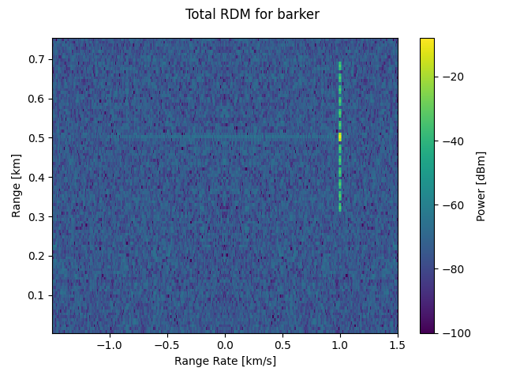

# Radar Signal Processing

[](https://github.com/JohnNehls/radar-signal-processing/actions/workflows/python-app.yml)

A Python module for simulating pulse-Doppler radar returns and generating
range-Doppler maps (RDMs). Designed for radar engineers and students who want
to build intuition for how RDMs are formed, how waveforms affect resolution,
and how DRFM electronic attack techniques appear in the RDM.

## Modules

-   [rdm](src/rsp/rdm.py) — range-Doppler map generation
-   [pulse_doppler_radar](src/rsp/pulse_doppler_radar.py) — radar system parameter model
-   [waveform](src/rsp/waveform.py) — uncoded, Barker, random-coded, and LFM pulse generation
-   [returns](src/rsp/returns.py) — skin return and DRFM jammer return models
-   [range_equation](src/rsp/range_equation.py) — radar and one-way link range equations
-   [uniform_linear_arrays](src/rsp/uniform_linear_arrays.py) — ULA gain patterns and steering vectors
-   [monopulse](src/rsp/monopulse.py) — amplitude monopulse angle estimation
-   [vbm](src/rsp/vbm.py) — velocity bin masking EA slow-time modulation functions
-   [geometry](src/rsp/geometry.py) — range and range-rate from geometry
-   [noise](src/rsp/noise.py) — complex Gaussian noise generation
-   [utilities](src/rsp/utilities.py) — unit conversions and signal utilities

## Installation

### Requirements

-   Python >= 3.11
-   Python packages listed in [pyproject.toml](pyproject.toml)
-   A few exercises use LaTeX for plot labels — LaTeX must be installed for
    those to run

### Steps

Clone the repository and install with pip:

``` shell
git clone https://github.com/JohnNehls/radar-signal-processing
pip install radar-signal-processing/
```

## Usage

### RDM generator

```python
from rsp import rdm, Radar, Target, Return, barker_coded_waveform

radar = Radar(
    fcar=10e9,
    tx_power=1e3,
    tx_gain=10 ** (30 / 10),
    rx_gain=10 ** (30 / 10),
    op_temp=290,
    sample_rate=20e6,
    noise_factor=10 ** (8 / 10),
    total_losses=10 ** (8 / 10),
    prf=200e3,
    dwell_time=2e-3,
)

waveform = barker_coded_waveform(10e6, nchips=13)

return_list = [Return(target=Target(range=0.5e3, range_rate=1.0e3, rcs=1))]

rdm.gen(radar, waveform, return_list)
```



Other available waveforms: `uncoded_waveform`, `random_coded_waveform`, `lfm_waveform`.

For additional examples including DRFM jammer returns and VBM, see
[apps/rdms](apps/rdms). [kitchen_sink.py](apps/rdms/kitchen_sink.py) shows
all waveform and return options.

### Everything else

For examples of the other module functions, see the
[exercises](apps/exercises).

## Testing

-   To run the pytests:

``` shell
python -m pytest tests/ -v
```

-   To run all apps and check for errors:

``` shell
./apps/run_apps.sh
```

This script runs all Python files in `apps/exercises/`, `apps/rdms/`, and
`apps/studies/` with the `Agg` matplotlib backend so no display is required.
Files ending in `_no_test.py` are skipped. The script exits with a non-zero
status if any file fails.

## Contributing

Contributions are welcome. Please fork the repository and submit a pull
request.

## License

This project is licensed under the GPL-3.0 License - see
[LICENSE](LICENSE) for details.
